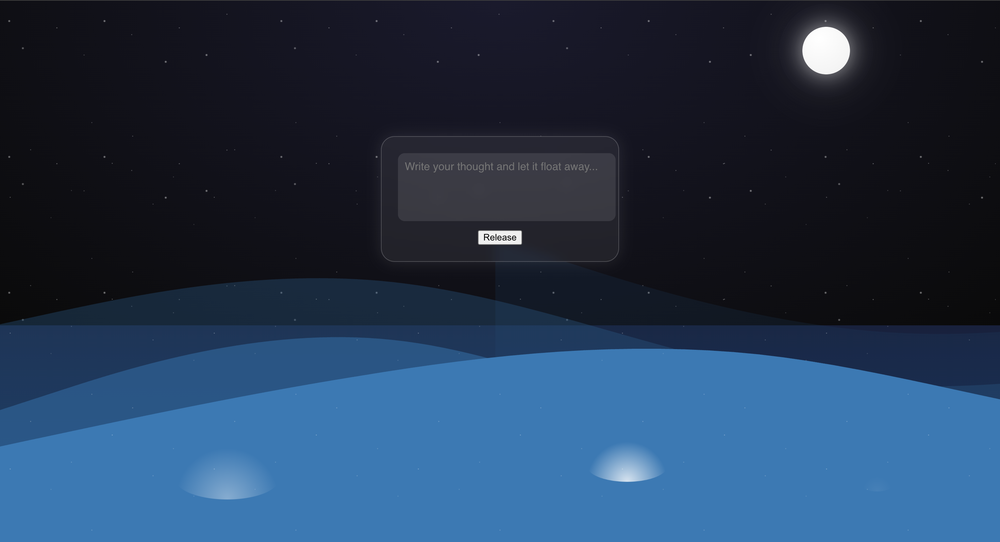
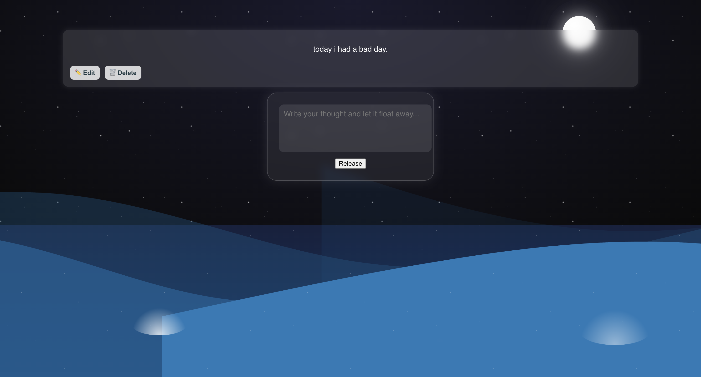

# 🌊 Drift — Thought Venting App

Drift is a minimalist, calming web app where users can write their thoughts and release them into a dreamy ocean under a moonlit sky. It combines expressive design with a clean Node.js + React stack to offer a peaceful and therapeutic experience.

---

## ✨ Features

- 🧠 Write and "release" your thoughts into the sea  
- 🕊️ Thoughts float away with animations  
- 📜 View, edit, and delete previously released thoughts  
- 🌊 Dynamic, layered SVG ocean waves  
- 🌌 Starry night background with glowing moon  
- 🎨 Immersive, soothing UI designed to evoke emotional calm  

---

## 🛠️ Tech Stack

| Layer        | Tech                    |
| ------------ | ----------------------- |
| Frontend     | React, CSS Animations   |
| Backend      | Node.js, Express        |
| Database     | MongoDB, Mongoose       |
| Communication| Axios (RESTful API)     |

---

## 📷 Screenshots

### 🌃 Night Sky UI  

### 🧘 Thought Releasing & History  

---

## 📚 Use Cases

- Digital journaling / venting  
- Self-reflection  
- Meditation & mindfulness practice  
- Demo project for learning full-stack CRUD

---

## 📦 API Endpoints (REST)

| Method | Endpoint               | Purpose                    |
|--------|------------------------|----------------------------|
| GET    | `/api/thoughts`        | Fetch all thoughts         |
| POST   | `/api/thoughts`        | Add a new thought          |
| PUT    | `/api/thoughts/:id`    | Edit a thought             |
| DELETE | `/api/thoughts/:id`    | Delete a thought           |

---

## 🧘 Inspiration

Built with the intention to create a digital safe space for users to process their emotions in solitude — gently, quietly, and beautifully.

---

## ©️ Author

**Tuhina** – [GitHub Profile](https://github.com/ttuhina)
